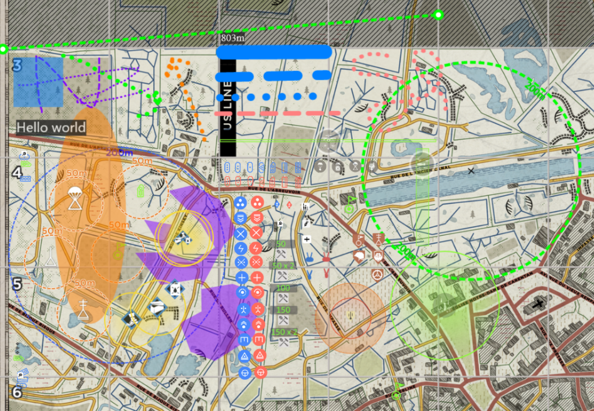

# ANZR Maps Let Loose

Advanced custom tactical maps for Hell Let Loose with real-time collaboration and strategic planning tools.

🔗 **Live Application**: [https://gbone001.github.io/maps-let-loose/](https://gbone001.github.io/maps-let-loose/)



## ✨ Key Features

### 🎯 Tactical Planning
- Plan garrison locations with 200m radius visualization
- View offensive default garrison positions for strategic attacks
- Calculate maximum artillery ranges and target coverage
- Measure distances for AT gun positioning and sniper shots
- Access comprehensive strongpoint and resource information

### 🤝 Real-Time Collaboration
- **Collaborative Rooms**: Edit tactical maps live with your team
- **Password Protection**: Secure access with custom room passwords
- **Multi-User Support**: Multiple players can edit simultaneously
- **Session Management**: Rooms auto-expire after inactivity for security

### 🛠 Advanced Tools & Assets
- **Military Assets**: Garrisons, OPs, Airheads, Halftracks, Tanks, Trucks, AT Guns
- **Strategic Markers**: Player classes, repair stations, supply nodes
- **Command Abilities**: Artillery strikes, supply drops, reconnaissance
- **Drawing Tools**: Free-form drawing, shapes, text boxes, measurement tools
- **Visual Controls**: Toggle grids, strongpoints, friendly/enemy indicators

### 💾 Export & Save
- **High-Quality Export**: Save maps as 1920x1920 PNG images
- **Configuration Backup**: Export/import map configurations as ZIP files
- **Mobile-Friendly**: Responsive design for tablet and mobile use
- **Auto-Scaling**: Elements automatically scale based on zoom level

## 🚀 Server Setup & Deployment

This project includes a complete Socket.io server for real-time collaborative rooms. The server enables multiple users to edit tactical maps simultaneously with live updates.

### 🏃‍♂️ Quick Local Development

1. **Install server dependencies:**
   ```bash
   cd server
   npm install
   ```

2. **Run server locally:**
   ```bash
   npm start
   # Server starts on http://localhost:3001
   ```

3. **Run with auto-reload (development):**
   ```bash
   npm run dev
   ```

### ☁️ Deploy to Railway (Recommended)

We've included full automation for Railway deployment:

1. **One-click deployment checker:**
   ```bash
   npm run setup-railway
   ```

2. **Follow the deployment guide:**
   - See [`RAILWAY-DEPLOYMENT.md`](./RAILWAY-DEPLOYMENT.md) for complete instructions
   - Automated CI/CD with GitHub Actions included
   - Health monitoring and logging built-in

3. **Quick deployment:**
   - Sign up at [Railway](https://railway.app)
   - Connect this GitHub repository
   - Railway auto-deploys from `/server` directory
   - Update client code with your server URL

### 📚 Documentation

- **[Server Setup](./server/README.md)** - Detailed server configuration
- **[Railway Deployment](./RAILWAY-DEPLOYMENT.md)** - Complete deployment guide  
- **[Deployment Ready](./DEPLOYMENT-READY.md)** - Your action plan
- **[Setup Checker](./setup-railway.js)** - Validates deployment readiness

### 🔧 Available Scripts

```bash
# Project-level scripts
npm run server          # Start the server
npm run server:dev      # Start with auto-reload
npm run server:install  # Install server dependencies
npm run setup-railway   # Check deployment readiness

# Server-level scripts (from /server directory)
npm start              # Production server
npm run dev           # Development with nodemon
npm test              # Run server tests
```

## 🔐 Security & Access

- **Password Protection**: Site-wide password protection for secure access
- **Room Security**: Individual room passwords for private tactical sessions
- **CORS Protection**: Server-side security for authorized domains only
- **Session Management**: Automatic cleanup of inactive rooms

## 🏢 ANZR Branding

This is the official ANZR (Australian & New Zealand Regiment) version of the tactical maps tool, featuring:
- Custom ANZR logo and branding
- Tailored for clan tactical planning
- Enhanced collaboration features for team coordination
- Optimized for competitive Hell Let Loose gameplay

---

## 🛠 Development & Contributing

### Build from Source

Refer to [BUILD.md](./BUILD.md) for instructions on how to build and run from source.

### Contributing

Contributions are welcome! Please refer to [CONTRIBUTING.md](./CONTRIBUTING.md) for guidelines.

### Project Structure

```
anzr-maps-let-loose/
├── server/                 # Socket.io backend server
├── .github/workflows/      # CI/CD automation
├── assets/                 # Game assets and icons
├── _layouts/              # HTML templates
├── script.js              # Main client application
├── styles.css             # Application styling
└── index.html            # Main application page
```

## 📄 License & Credits

- Original concept and implementation by [mattw.io](https://github.com/mattw)
- Enhanced and maintained by ANZR for competitive Hell Let Loose
- Built for the Hell Let Loose tactical planning community

## 🆘 Support

- **Documentation**: Check the guides in this repository
- **Issues**: Use GitHub Issues for bug reports and feature requests
- **Deployment Help**: See `RAILWAY-DEPLOYMENT.md` for deployment assistance
